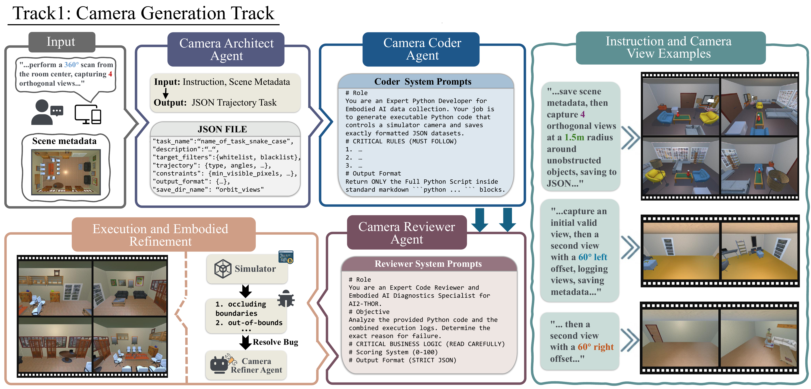
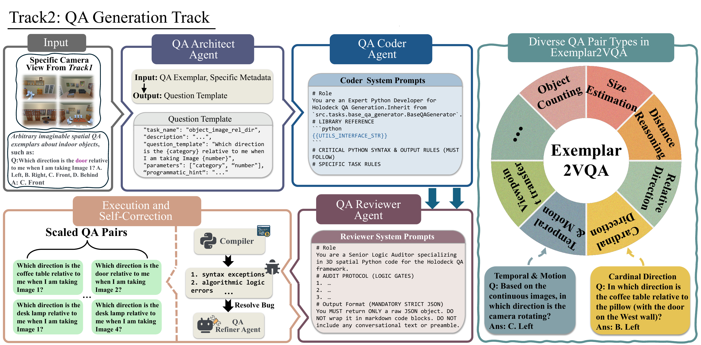

<h1 align="center">Exemplar2VQA</h1>

<h3 align="center">A Scalable Exemplar-Driven Visual Question Answering Generation Framework via Multi-Agent Coding</h3>

<p align="center">
  <a href="https://github.com/yingjiayu12/Exemplar2VQA"></a>
  <a href="https://arxiv.org/abs/2609.37655"></a>
  <a href="https://creativecommons.org/licenses/by/4.0/"></a>
</p>

Exemplar2VQA is a dual-track framework for synthesizing large-scale, high-fidelity spatial visual question answering data in simulated 3D environments. Instead of asking an LLM to guess spatial relationships, it uses specialized agents to generate executable Python programs and delegates geometric reasoning to deterministic utilities and simulator feedback.

Given a compatible 3D scene and a spatial QA exemplar, Exemplar2VQA produces multi-view observations, grounded questions, and programmatically computed answers:

```text
3D scene + capture instruction + QA exemplar
                    |
                    v
       camera views + scene metadata
                    |
                    v
       executable QA generation code
                    |
                    v
          grounded spatial QA pairs
```

## Framework

### Track 1: Camera Generation

Track 1 translates natural-language capture instructions into AI2-THOR camera programs. Generated programs load each scene, extract deduplicated object metadata, capture requested views, and save visible-object records. A reviewer/refiner loop diagnoses runtime and physics failures.

<p align="center">
  
</p>

### Track 2: QA Generation

Track 2 consumes the metadata and visible-view JSON files produced by Track 1. It extracts compact schemas, abstracts QA exemplars into task plans, generates executable QA programs, and reviews/refines those programs before saving the final QA pairs.

<p align="center">
  
</p>

## Repository Layout

```text
Exemplar2VQA/
├── Track1/
│   ├── data/scenes/                 # Example Holodeck-compatible scene JSON files
│   ├── Track1_Pipeline/
│   │   ├── Instructions.py          # Camera collection instructions
│   │   ├── camera_skills.py         # Simulator and camera APIs
│   │   ├── run_camera_agent.py      # Architect and coder stages
│   │   ├── run_camera_reviewer.py   # Reviewer and refiner stages
│   │   └── run.sh                   # Track 1 entry point
│   └── requirements.txt
├── Track2/
│   ├── Track2_pipeline/
│   │   ├── Example.py               # QA exemplars
│   │   ├── prepare_data.py          # Track 1 to Track 2 data bridge
│   │   ├── 1_extract_schema.py
│   │   ├── 2_architect_plan.py
│   │   ├── 3_coder_generate.py
│   │   ├── 4_code_refiner.py
│   │   └── run.sh                   # Track 2 entry point
│   ├── question_templates.py
│   ├── utils/
│   └── requirements.txt
├── docs/assets/                     # README figures
└── run_pipeline.sh                  # End-to-end entry point
```

## Requirements

The generation pipeline is intended for a Linux CUDA environment. Windows users should run it through WSL2 or another Linux environment supported by AI2-THOR and vLLM.

Recommended configuration:

- Python 3.10 or newer
- CUDA-capable GPU(s)
- Holodeck/Objaverse assets required by AI2-THOR procedural scenes
- vLLM for the original Linux multi-GPU setup, or Transformers for local development
- Alternatively, access to an OpenAI-compatible API

## Model Backends

Exemplar2VQA supports both open-weight local models and closed-source models exposed through an OpenAI-compatible chat-completions API. The same backend configuration is shared by Track 1 and Track 2, so users can choose the option that best fits their hardware, privacy requirements, and budget.

### Local Qwen3-Coder

The original and default model is [`Qwen/Qwen3-Coder-30B-A3B-Instruct`](https://huggingface.co/Qwen/Qwen3-Coder-30B-A3B-Instruct). The recommended Linux multi-GPU configuration uses vLLM:

```bash
export CUDA_VISIBLE_DEVICES=0,1
export EXEMPLAR2VQA_LLM_BACKEND=vllm
export EXEMPLAR2VQA_TENSOR_PARALLEL_SIZE=2
export EXEMPLAR2VQA_MODEL_PATH=Qwen/Qwen3-Coder-30B-A3B-Instruct
export HF_HUB_OFFLINE=0
```

Set `HF_HUB_OFFLINE=1` after the model is available in the local Hugging Face cache. A local checkpoint directory may be supplied instead of the Hugging Face model ID:

```bash
export EXEMPLAR2VQA_MODEL_PATH=/path/to/Qwen3-Coder-30B-A3B-Instruct
```

For single-GPU development, select `EXEMPLAR2VQA_LLM_BACKEND=transformers`. The 30B model may require quantization, CPU offloading, or a GPU with substantially more memory; a smaller compatible instruction/code model can also be used for functional testing.

### Closed-Source API Models

To use GPT or another hosted model, select the `openai` backend and point it to any OpenAI-compatible `/v1/chat/completions` service:

```bash
export EXEMPLAR2VQA_LLM_BACKEND=openai
export EXEMPLAR2VQA_API_BASE=https://api.openai.com/v1
export EXEMPLAR2VQA_API_MODEL=gpt-5.5
export EXEMPLAR2VQA_API_KEY=YOUR_API_KEY
```

`OPENAI_API_KEY` can be used instead of `EXEMPLAR2VQA_API_KEY`. Model availability and exact identifiers depend on the selected provider.

Once a backend is configured, use the same Track 1, Track 2, or end-to-end commands shown below. No Prompt changes are required when switching backends.

## Installation

Clone Exemplar2VQA and Holodeck, then install the dependencies required by both tracks:

```bash
git clone https://github.com/yingjiayu12/Exemplar2VQA.git
git clone https://github.com/allenai/Holodeck.git
cd Exemplar2VQA

conda create -n exemplar2vqa python=3.10 -y
conda activate exemplar2vqa
pip install -r Track1/requirements.txt
pip install -r Track2/requirements.txt
```

Follow the [Holodeck installation and asset download instructions](https://github.com/allenai/Holodeck) before running Track 1. If your AI2-THOR build requires its dedicated package index, install the pinned version with:

```bash
pip install --extra-index-url https://ai2thor-pypi.allenai.org \
  ai2thor==0+6f165fdaf3cf2d03728f931f39261d14a67414d0
```

## Scene Data

Three example scenes are included under `Track1/data/scenes`:

```text
Track1/data/scenes/
├── scene_0/scene_0.json
├── scene_1/scene_1.json
└── scene_2/scene_2.json
```

You may generate additional scenes with [Holodeck](https://github.com/allenai/Holodeck), reuse ProcTHOR houses, or provide another source whose JSON follows the same AI2-THOR procedural-house schema. Each scene can be a JSON file or a directory containing one or more scene JSON files.

## Quick Start

### 1. Run Camera Generation

From the repository root:

```bash
bash Track1/Track1_Pipeline/run.sh
```

The portable entry point accepts three optional positional arguments:

```bash
bash Track1/Track1_Pipeline/run.sh \
  /path/to/scenes \
  /path/to/track1_output \
  A
```

The arguments are `SCENES_ROOT`, `OUTPUT_DIR`, and comma-separated `TASK_KEYS`. Defaults are `Track1/data/scenes`, `Track1/data/collected`, and `all`.

Edit `Track1/Track1_Pipeline/Instructions.py` to add or change camera collection tasks.

### 2. Generate QA Pairs

Track 2 now automatically discovers Track 1 outputs, copies the required metadata and referenced images, normalizes filenames, generates schemas, and processes every discovered scene:

```bash
bash Track2/Track2_pipeline/run.sh
```

To use custom locations or restrict migration to one Track 1 task key:

```bash
bash Track2/Track2_pipeline/run.sh \
  /path/to/track1_output \
  /path/to/track2_data \
  A
```

Edit `Track2/Track2_pipeline/Example.py` to provide the QA exemplars that should be generalized. Final files are written inside each prepared scene directory as `qa_<task_name>_holodeck.json`.

### End-to-End

Run both tracks with their default directories:

```bash
bash run_pipeline.sh
```

Or pass a custom scene directory, Track 1 output directory, Track 2 data directory, and task keys:

```bash
bash run_pipeline.sh \
  /path/to/scenes \
  /path/to/track1_output \
  /path/to/track2_data \
  A
```

## Data Contract Between Tracks

Track 2 expects one normalized directory per scene:

```text
Track2/Track2_pipeline/data/<scene_name>/
├── <scene_name>_bbox.json
├── <scene_name>_visible_views.json
└── referenced RGB images
```

`prepare_data.py` creates this layout automatically from nested Track 1 results. It ignores generated schema files, picks the matching visible-view record, and copies images referenced by `image_path` fields.

It can also be run independently:

```bash
python Track2/Track2_pipeline/prepare_data.py \
  --source /path/to/track1_output \
  --output Track2/Track2_pipeline/data \
  --task-key A
```


## Paper and Citation

The paper is available on [arXiv](https://arxiv.org/abs/2609.37655). If you find this project useful, please cite:

```bibtex
@misc{ying2026exemplar2vqascalableexemplardrivenvisual,
      title={Exemplar2VQA: A Scalable Exemplar-Driven Visual Question Answering Generation Framework via Multi-Agent Coding},
      author={Jiayu Ying and Qijian Tian and Ruijie Xu and Xinnan Zhu and Daoguo Dong and Jiachen Xu and Xin Tan},
      year={2026},
      eprint={2609.37655},
      archivePrefix={arXiv},
      primaryClass={cs.CV},
      url={https://arxiv.org/abs/2609.37655}
}
```

## Acknowledgements

Exemplar2VQA builds on [Holodeck](https://github.com/allenai/Holodeck), [AI2-THOR](https://ai2thor.allenai.org/), [ProcTHOR](https://procthor.allenai.org/), [Objaverse](https://objaverse.allenai.org/), [Qwen](https://github.com/QwenLM/Qwen3-Coder), and [vLLM](https://github.com/vllm-project/vllm). We thank the authors and maintainers of these projects.

## License

This project is licensed under the [Creative Commons Attribution 4.0 International License](LICENSE). You may share and adapt the material for any purpose, including commercial use, provided that appropriate credit is given, the license is linked, and changes are indicated.

Third-party models, assets, datasets, and dependencies remain subject to their respective licenses.
